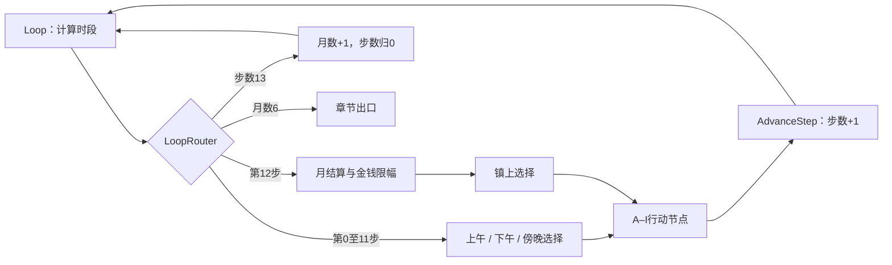

# 第二章：月数 + 当月步数的单一循环

## 2026-09-30 章节卡与第一章问答更新

第一章三段问答（日程安排、关于门派、关于妖怪）已封装为独立流程，完成后经跳转点返回提问菜单。“没有其他想问的了”仍进入原后续剧情。第一章现有24个节点。

第一章、第二章分别新增“第一章”“第二章”章节卡：Title模式，渐显0.8秒，点击后渐隐0.65秒。第一章卡后进入Town；第二章卡经TitleEnterJump进入Daily_Receive，循环始终返回Daily_Receive而不重播卡片。第二章现为75个节点（以下73节点描述为添加章节卡之前的结构）。两条标题文案已加入内容表并完成烘焙，原281行文案及译文保留。

原282条指令逐项一致。第一章四次问答返回、74次流程内存读档、两张卡各一次及进入第二章上午选择均通过；第二章4453项断言及260次存读档通过。验证为执行器和数据校验，不代表实际画面验收。备份与详细记录见 `.utmp/vn-story-import/20260930-chapter01-cards` 和同目录导入记录 `20260930-chapter01-cards.json`。旧存档指纹会失配，未删除存档。

第二章保留月数与当月步数驱动的单一循环。2026-09-30 已从22节点图迁移到正式跳转及复合流程：共73个资产，包括原22个节点、9个流程调用、9个流程开始、9个流程返回、9个接收点、15个跳转点。新增部分仅表达结构，不复制A–I行动逻辑。原有节点、指令和选项ID保持不变；迁移前备份位于 `.utmp/vn-story-import/20260930-native-flow/backup`。

## 日程只有两个进度变量

画布阅读方式：左侧为每日分流、换月、月末结算及统一步数推进；右侧按上午、下午、傍晚、镇上排列四个选择区域；顶部右侧为红色章节出口。下方三行独立区域为A–I流程，每个流程均为“开始 → 原行动节点 → 完成返回”。

已关闭旧的距离判断连线折叠，跨区连接使用正式Jump/Receiver。右键跳转点可定位接收点；右键接收点可查看来源；右键调用节点可进入独立流程视图、定位流程开始或折叠流程。关联线按需显示，普通直连均向右排列。入口为Daily_Receive，出口仍为Exit。

| 变量 | 初始值 | 含义 |
|---|---|---|
| ch2_month | 1 | 当前月数，1–5；到6表示第二章完成 |
| ch2_monthStep | 0 | 当前月的行动步数，0–12 |

第0–11步是前4天的上午、下午、傍晚。日期=`step / 3 + 1`（整数除法），时段=`step % 3`，0/1/2分别表示上午/下午/傍晚。第12步先结算，再进入镇上H/I选择。该行动完成后步数变13，统一执行月数+1、步数归0。第五个月结束后进入现有预览结束章节。

## 22个节点的分工

- 4个循环控制：Loop、LoopRouter、AdvanceStep、NextMonth。
- 4个选择：Morning、Afternoon、Evening、Town。
- 9个行动：A_Action至I_Action，正文暂空，包含相应计数或数值指令。
- 4个结算节点：Settlement、MoneyBounds、MoneyMax、MoneyMin。
- 1个章节出口：Exit。

## 行动与事件次数

上午选A清扫、B种地、C陪香客唠家常；下午选D学习、E燕于飞找你玩；傍晚选F后山探险、G陪师父吃饭；镇上选H游戏厅、I买礼物。

`ch2_cVisits / ch2_eVisits / ch2_hVisits`记录各行动累计完成次数，不是日程计数，也不封顶。F在C完成2次后开放；E在H完成1次后、当月第4或10步（第2/4天下午）开放。每条行动路径只增加一次访问次数。

目前没有真实事件正文，因此C001–C007、E001–E007、H001–H004不再各建一个空资产。后续填入事件时，进入对应行动前的访问次数+1就是下一候选事件序号；超过7/7/4时进入各自兜底。A的当月次数同理区分前两次与后续内容。分支选择改变事件顺序等复杂逻辑应在真实内容导入时另行补充。

`ch2_monthClean / ch2_monthPlant`分别记录当月清扫、种地次数。净收入=随机整数[100,150]+清扫×10+经营能力−50+种地×5，结算后清零。金钱限幅0–1000。H要求余额≥20并扣20一次。D/I目前不增加能力、不发商品、不收礼物费用。

## 玩家数据与临时值

玩家属性继续由Story全局变量保存，随剧情进度统一存档。金钱初始25，四位角色好感、洞察/经营/无为初始0；法力仅预留，`player_manaConfigured=false`。物品列表仍为字符串`[]`，尚未接入商品内容。

共21个全局变量（含原有playerName、玩家属性及行动计数）。5个章节临时变量`loop_slot / loop_eWindow / loop_income / loop_cleanBonus / loop_plantDiscount`只用于取余和结算，不独立推进时间。日期、独立时段进度、累计行动数、结算次数、已结算标记和逐事件完成标记已移除。

## 后续填正文

在Unity第二章图中从A_Call–I_Call进入对应流程，编辑原A_Action–I_Action。新增内部节点须归入对应A_Start–I_Start作用域，完成时接到对应FlowReturn，由调用节点的“完成”结果返回主线，再跳转到统一AdvanceStep。保留计数/扣费指令且只执行一次，不从内部直接跳回主线。当前未新增取消、成功或失败选项，正文仍留空。

## 验证

真实配表Story校验通过。4组流程每组65次行动、5次月结算，最终金钱与原95节点版本逐组一致（558、514、285、445）。4449项断言及260次存档恢复检查通过；每组只有5次收入抽样，覆盖E/F解锁、余额19/20、月结算、经营加成、金钱限幅、重复点击和第一章衔接。

本章使用21条多语言文案，本次结构迁移未修改正文、选项或配表。迁移后4449项行为断言、260次存读档仍通过；另在内存副本给九个内部行动各加等待点，逐项验证调用栈存读档、剩余等待恢复、正确返回及重复回调拒绝，未把测试等待写入正式资产。73张卡片无重叠，控制台无错误或警告。新结构会使旧存档语义指纹失配，需要从新档重新开始；未删除任何存档。
